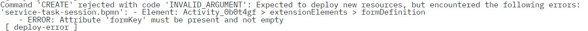
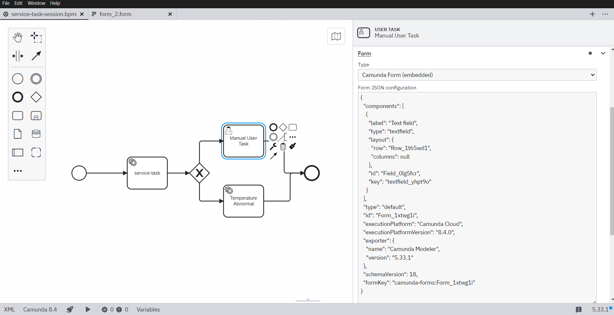

1)Execution Enginecontainers: from https://github.com/techbuzzblogs/camunda/tree/main/camunda-platform-8.0.0
   2) dowload the YAML file
   3) RUN docker-compose -f docker-compose-core.yaml up -d
   4) Download connectors https://hub.docker.com/r/camunda/connectors

Infastructure
1) Run CWS docker image
2) Run CWS Intelij main class
3) Design and deploy BPMN
4) Execute the BPMN
   5) Invoke-WebRequest -Uri "http://localhost:8080/process/deploy?filePath=src/main/resources/service-task-session.bpmn" -Method POST
   6) Invoke-WebRequest -Uri "http://localhost:8080/process/execute?processId=service-task-session" -Method POST

5) Open Camunda processes and tasklist from docker to see the execution
6) For the database
   1) Go to the External systems folder inside the PatientMedicalRecordsDb
   2) docker-compose up --build 
      3) to build the container containing the database pretending the external system

So far what I have:
1) Service task can execute precompiles classes in the project in order to publish specific topics to the message broker
   2) Is there any way to directly publish topics?
   3) So this will be the precompiles functionality in the design BPMN time to publish topics
3) Then Message broker publish topics
4) Adaptors implement HL7 and trigger with the appropriate system to execute the UF

Next Steps:
1) Validate Functionality of the implemented components
   1) Precompiled Functionality
   2) Adaptor
   3) External System
2) Validate Broker Facrionality
   1) What if there are two consumers or 2 external systems publish the smae information?
      2) How the broker works. I  assume that it works like the topics. Make it work like that
   2) Implement two different adaptors 
   3) Two external systems 
   4) Evaluate how the tasks in the pbmn can use the precompiled functionality to build the logic
   5) What pre-post conditions can be implemented in the UF and how can be implemented?
   6) See the definition for the Unit duntion that I gave and see how it can be implemented

Question to Aly:
1) Is what I am doing the wanted?
2) Map the current architecture with mine
3) Evaluate the 3 scenarios for deployment scenarios

Problems:
1)  OR the form does not appear?
   2) Just embed the JSON of the form inside the BPMN
      3) 

Documentation:

1) Camunda8Application.java: The main Spring Boot application class responsible for bootstrapping the application and initializing all configured components and services. It includes the @EnableZeebeClient annotation to connect the application to the Zeebe broker.

2) TemperatureTake.java: Defines the logic for handling specific process tasks related to temperature monitoring. Interacts with RabbitMQ to publish messages to adaptors for requesting temperature from external systems

3) PMAdaptor.java (Formerly TemperatureAdaptor.java): Acts as adaptow that listens to interested topics and sends Requests to PM. Same way once it has a response publish to specific topics the response data

Dynamic BPMN Reconfiguration, Deployment and Execution

1) DynamicQueueManager.java: 
   1) Provides functionlity for dynamic creation and deletion of message queues within RabbitMQ.
   2) Then the consumers producers use it to decrate the routing keys and queues.
   3) It also creates the exchange 

2) ProcessController.java: Exposes REST endpoints to deploy BPMN files and start process instances, providing an interface for internal system to deploy new BPMNs and for external systems or users to trigger workflows within the application. 
   3) ProcessDeployer.java: Handles the deployment of BPMN files to the Zeebe broker by reading files from disk and sending them via the Zeebe client, logging the deployment results. 
   4) ProcessExecutor.java: Responsible for starting process instances on the Zeebe broker based on the deployed process IDs. It accepts variables as input and triggers the appropriate process execution.

application.properties: Configuration file containing settings related to the Spring Boot application, including Zeebe broker connection details, RabbitMQ settings, and other application-specific properties.

service-task-session.bpmn: BPMN file defining a different workflow, potentially with service tasks requiring integration with external systems or automated processing.

docker-compose.yaml: Configuration file defining services, networks, and dependencies for running the application with Docker, including Zeebe broker, RabbitMQ, and other components as containers.

Current Idea:

1) Edit
2) Deploy
   3) Invoke-WebRequest -Uri "http://localhost:8080/process/deploy?filePath=src/main/resources/service-task-session.bpmn" -Method POST
4) Execute 
   5) Manualy 
   6) Automatically from PM (not yet) but simple executing: Invoke-WebRequest -Uri "http://localhost:8181/trigger-sepsis" -Method POST -Body (@{ patientId = 1 } | ConvertTo-Json) -ContentType "application/json" or from inside the PM adaptor container    curl -X POST http://localhost:8181/trigger-sepsis -H "Content-Type: application/json" -d '{"patientId": 1}'

      7) Now the PM adaptor received request 
      8) Publish sepsis.execution
      9) ProcessExecutor Listens and executes the process with the correc ID
      10) Service task is executed and calls TemperatureTaking
      11) Publish topic to the adaptor and recieving the temperature from a server like being the PM.
      12) Value is published to temperature.response to the TemperatureTakings
      13) Value goas back to the BPMN

ToDo
1) Chagnge scherarios and run without recompilation
2) Presentation
3) Clean Code and create scenarios that must be handled by the system

Docker)
Create the jar from the maven (View->Tools Window->Maven->Lifecycle->package or install) and then create the docker container and run it

docker build -t uf-temperature .
docker run --name temperature-uf -e SPRING_PROFILES_ACTIVE=dev -e SPRING_RABBITMQ_HOST=host.docker.internal -e ZEEBE_CLIENT_BROKER_GATEWAY-ADDRESS=host.docker.internal:26500 uf-temperature

docker build -t pm-adaptor .
docker run -d --name pm-adaptor -e SPRING_RABBITMQ_HOST=host.docker.internal -p 8083:8080  pm-adaptor

For building all the contaies(UFs and Adaptors):
go to CWS folder and do:
Create once again the jars
docker compose build
docker compose up (or docker compose up heart-rate temperature) for runing specific UFs
)
For the external systems (db & patient monitor build/run them indipendently)